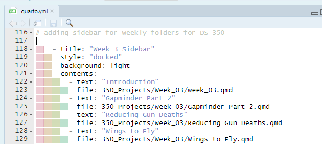

# BYUI DS Portfolio Template for course contents

# Adding QMD files for DS 350

-   add qmd file to respective week folder (only qmd file)
-   in the \_quarto.yml file add the qmd name and folder path for the week sidebar

    - Just need to add two lines of code, a "- text" and "file" lines of code to succesfully add a new qmd tot he _quarto.yml file. 
    -   In the index.qmd file, add week link if needed
-   For respective week, Add the sidebar content in the week_02.qmd file.
    -   week_02.qmd file inside the respective week folder.
    -   Add name and file path
-   Edit weekly notes if needed
-   Edit gitpush_notes file

# Editing other files

## resume.qmd edits

   - To edit this folder, just open it and go ham. 
   - Just ask chatgpt this. Can you please edit the resume.qmd file, the current qmd code is just a template so it is not needed. I provided my resume at the bottom so you can use the contents of my resume to rebuild my resume.qmd code. thanks
   - have a section where you tell chagpt where the qmd code starts, so copy the resume qmd code to chatgpt, and aso seperate your resume info. 

Here starts the resume qmd code

qmd code here

Here starts my resume info

resume info here.

hit enter and watch ai do this for you. 

# editing other files or adding new tabs etc.

The index.qmd file and _quarto.yml files are the main files you have to worrry about updating.
This files control the website layout and the sidebar content.
So if you want to remove the Ds 460 tab, just delete the respective lines of code in the index.qmd and _quarto.yml files that refer to DS 460. 
This index.qmd file does not have any DS 460 code so you only need to delete the _quarto.yml lines
Then you delete every file link to DS 450, so the DS 460 folder, 460_projects.qmd. 
Delete the DS 460 files and or folders in the docs folder as well.

Now if you want to add a new tab. instead of deleting the DS 460 _quarto.yml code, copy it and paste it again, and update the names 
to your new desire tab info. You will have to make sure the file path names you use are the same as the actual file names.
You will obviously have to add the files to the their respective places, but you dont need to add anything to the docs folder. 
When you render, the htmls automatically go to the docs folder.

basically adding new tabs is the same process as other so just copy and paste and change names, and add the new files. 
